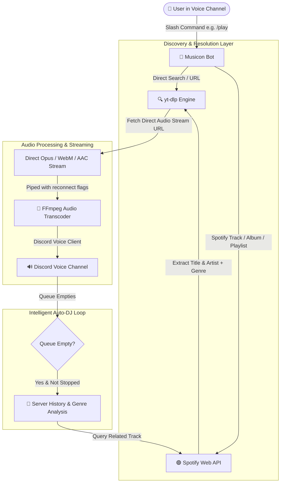

<div align="center">

# 🎧 Musicon

<p align="center">
  <strong>A Next-Generation, High-Fidelity Discord Music Bot powered by Discord.py, yt-dlp, and Spotify with Intelligent Auto-DJ.</strong>
</p>

[](https://www.python.org/)
[](https://discordpy.readthedocs.io/)
[](https://developer.spotify.com/)
[](https://github.com/yt-dlp/yt-dlp)
[](https://ffmpeg.org/)
[](LICENSE)

<br />

[Features](#-key-features) • [Architecture](#-architecture) • [Slash Commands](#-slash-commands) • [Installation](#-installation) • [Configuration](#-configuration) • [Spotify Setup](#-spotify-integration) • [YouTube Cookies](#-youtube-cookie-bypass) • [Deployment](#-deployment)

</div>

---

## ✨ Overview

**Musicon** is a modern, modular Discord music bot engineered for uncompromising audio performance and reliability. It combines native Discord Slash Commands, robust YouTube audio extraction via `yt-dlp`, deep Spotify catalog resolution with genre classification via `spotipy`, and a smart **Auto-DJ** recommendation algorithm that keeps the party alive even when your queue runs empty.

Whether you're listening to single tracks, entire Spotify albums, or massive playlists, Musicon resolves and streams audio with zero lag and high-fidelity sound.

---

## 🚀 Key Features

<table>
  <tr>
    <td width="50%">
      <h3>🤖 Intelligent Auto-DJ</h3>
      <p>Never experience an awkward silence again. When the queue runs empty, Musicon analyzes the server's recent listening history and Spotify artist genres to seamlessly generate and queue matching songs on the fly.</p>
    </td>
    <td width="50%">
      <h3>🎵 Multi-Platform Ingestion</h3>
      <p>Play anything effortlessly: YouTube track URLs, YouTube searches, YouTube playlists, Spotify tracks, Spotify albums, and Spotify public/collaborative playlists.</p>
    </td>
  </tr>
  <tr>
    <td width="50%">
      <h3>⚡ 100% Native Slash Commands</h3>
      <p>Built exclusively on Discord's modern Application Commands (<code>/play</code>, <code>/skip</code>, <code>/pause</code>, <code>/resume</code>, <code>/queue</code>, etc.) with interactive embeds, real-time feedback, and zero clutter.</p>
    </td>
    <td width="50%">
      <h3>🛡️ YouTube Anti-Bot & Cookie Bypass</h3>
      <p>Bypass YouTube rate limits, bot verification screens, and age-restrictions with built-in support for exported browser cookies (<code>youtube_cookies.txt</code>) or local browser profile loading.</p>
    </td>
  </tr>
  <tr>
    <td width="50%">
      <h3>🔄 Self-Healing Audio Pipeline</h3>
      <p>Equipped with automatic voice reconnection logic, concurrent queue safety locks, and resilient FFmpeg stream reconnection arguments to survive network hiccups.</p>
    </td>
    <td width="50%">
      <h3>🎨 Rich Dynamic Embeds</h3>
      <p>Sleek, informative Discord embeds display track title, artists, thumbnails, playback status, queue pages, and dedicated Auto-DJ visual badges.</p>
    </td>
  </tr>
</table>

---

## 🏗 Architecture

Musicon separates media discovery, metadata resolution, audio extraction, and voice delivery into a streamlined pipeline:



---

## 🎮 Slash Commands

| Command | Arguments | Description | Example |
| :--- | :--- | :--- | :--- |
| **`/play`** | `query` *(required)* | Search YouTube, or provide a YouTube / Spotify track, album, or playlist link | `/play Bohemian Rhapsody`<br>`/play https://open.spotify.com/playlist/...` |
| **`/skip`** | *None* | Skips the track currently playing | `/skip` |
| **`/pause`** | *None* | Pauses the current audio playback | `/pause` |
| **`/resume`** | *None* | Resumes playback if currently paused | `/resume` |
| **`/stop`** | *None* | Stops playback, clears the queue, and disconnects the bot | `/stop` |
| **`/queue`** | *None* | Displays the currently active track and the upcoming queue | `/queue` |
| **`/history`** | *None* | Shows the last 5 tracks played in the server, with Auto-DJ badges | `/history` |
| **`/spotify_auth`** | *None* | *(Bot Owner only)* Authorizes Spotify OAuth for private/collaborative access | `/spotify_auth` |

---

## 📦 Project Structure

```text
Musicon/
├── MyBot.py                 # Core bot logic, commands, events, and Auto-DJ engine
├── requirements.txt         # Project Python dependencies
├── .env.example             # Template for required environment variables
├── .env                     # Your private credentials (DO NOT COMMIT)
├── youtube_cookies.txt      # Netscape-formatted YouTube cookies for anti-bot bypass
├── bin/
│   └── ffmpeg/
│       └── ffmpeg.exe       # Bundled FFmpeg executable (Windows fallback)
└── README.md                # Project documentation & setup guide
```

---

## 🛠 Installation

### 1. Clone the Repository

```bash
git clone https://github.com/yparshant610/Musicon.git
cd Musicon
```

### 2. Create and Activate a Virtual Environment

* **Windows (PowerShell)**:
  ```powershell
  python -m venv dc_env
  .\dc_env\Scripts\Activate.ps1
  ```

* **Linux / macOS**:
  ```bash
  python3 -m venv dc_env
  source dc_env/bin/activate
  ```

### 3. Install Python Dependencies

```bash
pip install --upgrade pip
pip install -r requirements.txt
```

### 4. Install FFmpeg

Musicon relies on **FFmpeg** to encode audio streams for Discord voice.

* **Windows**:
  - You can place `ffmpeg.exe` directly under `bin/ffmpeg/ffmpeg.exe` (detected automatically by Musicon), or
  - Install via Winget: `winget install Gyan.FFmpeg` and ensure it is on your system `PATH`.
* **Linux (Ubuntu/Debian)**:
  ```bash
  sudo apt update && sudo apt install -y ffmpeg
  ```
* **macOS (Homebrew)**:
  ```bash
  brew install ffmpeg
  ```

Verify your installation:
```bash
ffmpeg -version
```

---

## ⚙️ Configuration

Copy `.env.example` to `.env` (or create a new `.env` file) in the project root:

```bash
cp .env.example .env
```

### Environment Variables

Edit `.env` with your credentials:

```env
# ============================================================
# DISCORD CONFIGURATION
# ============================================================
DISCORD_TOKEN=your_discord_bot_token_here

# ============================================================
# SPOTIFY API CONFIGURATION
# ============================================================
Client_ID=your_spotify_client_id_here
Client_secret=your_spotify_client_secret_here
SPOTIFY_REDIRECT_URI=http://127.0.0.1:8888/callback

# ============================================================
# YOUTUBE COOKIE SETTINGS (RECOMMENDED FOR 24/7 HOSTING)
# ============================================================
# Path to your exported Netscape cookies file
YOUTUBE_COOKIE_FILE=youtube_cookies.txt

# Optional: Read cookies directly from a local browser (e.g., chrome, edge, firefox)
# Leave blank when using YOUTUBE_COOKIE_FILE or on remote servers (EC2/VPS)
YOUTUBE_BROWSER=
```

### Setting up the Discord Bot

1. Go to the [Discord Developer Portal](https://discord.com/developers/applications).
2. Click **New Application** and give your bot a name.
3. Under the **Bot** tab:
   - Click **Reset Token** and copy your token to `DISCORD_TOKEN` in `.env`.
   - Under **Privileged Gateway Intents**, enable:
     - ✅ **Server Members Intent** (recommended)
     - ✅ **Message Content Intent**
4. Under **OAuth2 > URL Generator**:
   - Select scopes: `bot`, `applications.commands`.
   - Bot permissions: `Connect`, `Speak`, `Send Messages`, `Embed Links`, `Read Message History`, `Use Slash Commands`.
   - Open the generated URL in your browser to invite the bot to your Discord server.

---

## 🟢 Spotify Integration

Musicon uses the Spotify Web API to resolve tracks, albums, artist metadata, and genre tags for Auto-DJ.

1. Navigate to the [Spotify Developer Dashboard](https://developer.spotify.com/dashboard) and log in.
2. Click **Create App**:
   - **App Name**: `Musicon Bot`
   - **Redirect URI**: `http://127.0.0.1:8888/callback` (Must match `SPOTIFY_REDIRECT_URI`)
   - **APIs Used**: Select **Web API**.
3. Under your app settings, copy:
   - **Client ID** ➔ Set to `Client_ID` in `.env`
   - **Client Secret** ➔ Set to `Client_secret` in `.env`
4. Once the bot starts up, the bot owner can run the slash command:
   ```text
   /spotify_auth
   ```
   Follow the prompt in your terminal or browser once to authenticate and generate `.spotify_cache`.

---

## 🍪 YouTube Cookie Bypass

To prevent YouTube from blocking requests with *"Sign in to confirm you're not a bot"* or IP throttling (especially when hosting on AWS, DigitalOcean, or other cloud providers):

1. Install a browser extension like **[Get cookies.txt LOCALLY](https://github.com/kairi003/Get-cookies.txt-LOCALLY)** (Chrome / Firefox).
2. Visit [YouTube.com](https://www.youtube.com) while signed into a Google account.
3. Open the extension and export the cookies in **Netscape** format.
4. Save the file as `youtube_cookies.txt` in the root folder of Musicon.
5. In `.env`, ensure:
   ```env
   YOUTUBE_COOKIE_FILE=youtube_cookies.txt
   ```

> **Security Note:** Keep your `youtube_cookies.txt` private. It is already added to `.gitignore` to prevent accidental commits.

---

## 🚀 Deployment

### Running Locally

To launch Musicon:

```bash
python MyBot.py
```

### Development vs Production Command Sync

In [MyBot.py](file:///d:/bot%20discord/MyBot.py):

* **Development Mode (`DEVELOPMENT_MODE = True`)**:
  Syncs slash commands immediately to `TEST_GUILD_ID` for instant testing without Discord's global command sync caching delay.
* **Production Mode (`DEVELOPMENT_MODE = False`)**:
  Registers commands globally across all guilds where the bot is invited.

### Running 24/7 on Linux (Systemd Service)

Create a systemd service file:

```bash
sudo nano /etc/systemd/system/musicon.service
```

Paste the following template (adjust paths and user accordingly):

```ini
[Unit]
Description=Musicon Discord Music Bot
After=network.target

[Service]
Type=simple
User=ubuntu
WorkingDirectory=/home/ubuntu/Musicon
ExecStart=/home/ubuntu/Musicon/dc_env/bin/python MyBot.py
Restart=always
RestartSec=10

[Install]
WantedBy=multi-user.target
```

Enable and start the service:

```bash
sudo systemctl daemon-reload
sudo systemctl enable musicon
sudo systemctl start musicon
sudo systemctl status musicon
```

---

## ❓ Troubleshooting

<details>
<summary><b>1. "Sign in to confirm you're not a bot" error from YouTube</b></summary>

YouTube frequently challenges data centers (e.g., AWS EC2, GCP, Hetzner). Ensure you have exported fresh cookies using the [YouTube Cookie Bypass](#-youtube-cookie-bypass) section and verified that `YOUTUBE_COOKIE_FILE` is set properly in `.env`.
</details>

<details>
<summary><b>2. "FFmpeg was not found" warning on startup</b></summary>

Ensure FFmpeg is installed and accessible either globally via your system `PATH` or located at `bin/ffmpeg/ffmpeg.exe`. You can test this by running `ffmpeg -version` in your terminal.
</details>

<details>
<summary><b>3. Slash commands do not appear in my server</b></summary>

- If `DEVELOPMENT_MODE = True`, make sure `TEST_GUILD_ID` matches your testing server ID.
- If `DEVELOPMENT_MODE = False`, Discord global command propagation can take anywhere from a few minutes up to an hour for brand-new applications.
- Re-invite the bot with the `applications.commands` scope checked.
</details>

<details>
<summary><b>4. Bot disconnects immediately after joining</b></summary>

Check your Discord voice region settings or server bitrate. If the bot is the only member left in the voice channel, Musicon gracefully disconnects to conserve resources.
</details>

---

## 🤝 Contributing

Contributions, bug reports, and feature requests are warmly welcomed!

1. Fork the Project
2. Create your Feature Branch (`git checkout -b feature/AmazingFeature`)
3. Commit your Changes (`git commit -m 'Add some AmazingFeature'`)
4. Push to the Branch (`git push origin feature/AmazingFeature`)
5. Open a Pull Request

---

## 📄 License

Distributed under the **MIT License**. See `LICENSE` for more information.

---

<div align="center">
  <sub>Crafted with passion for music and code by <a href="https://github.com/yparshant610">yparshant610</a>.</sub>
</div>
